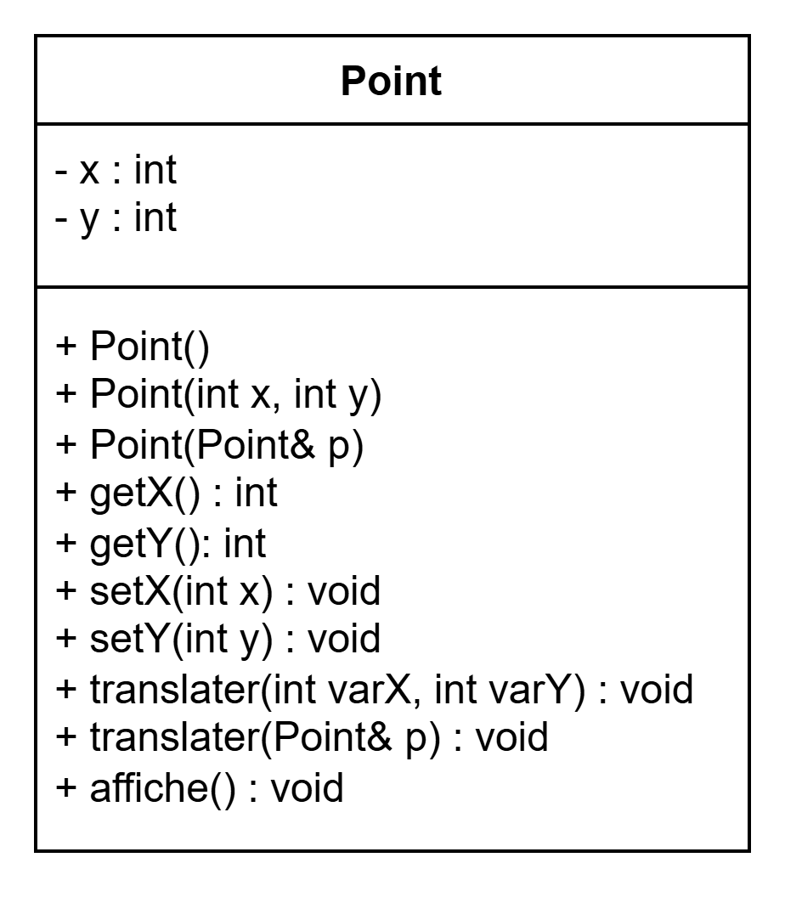
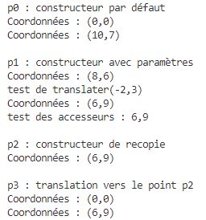
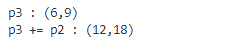
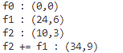
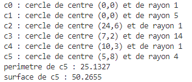

# Compte-rendu TP7 classes

<!-- TOC -->

- [Compte-rendu TP7 classes](#compte-rendu-tp7-classes)
    - [Création d'une classe Point](#cr%C3%A9ation-dune-classe-point)
        - [Diagramme de la classe Point](#diagramme-de-la-classe-point)
        - [Fichier point.h :](#fichier-pointh-)
        - [Fichier point.cpp :](#fichier-pointcpp-)
        - [Jeu d'essais pour les méthodes de la classe Point](#jeu-dessais-pour-les-m%C3%A9thodes-de-la-classe-point)
    - [Surchage d'opérateurs](#surchage-dop%C3%A9rateurs)
        - [Mise à jour du fichier point.h](#mise-%C3%A0-jour-du-fichier-pointh)
        - [Mise à jour du fichier point.cpp](#mise-%C3%A0-jour-du-fichier-pointcpp)
        - [Jeu d'essais pour les surcharges d'opérateurs de la classe Point](#jeu-dessais-pour-les-surcharges-dop%C3%A9rateurs-de-la-classe-point)
    - [Formes géométriques abstraites](#formes-g%C3%A9om%C3%A9triques-abstraites)
        - [Extrait du fichier forme.h](#extrait-du-fichier-formeh)
        - [Extrait du fichier forme.cpp](#extrait-du-fichier-formecpp)
        - [Jeu d'essais pour la classe Forme](#jeu-dessais-pour-la-classe-forme)
    - [Formes géométriques concrètes](#formes-g%C3%A9om%C3%A9triques-concr%C3%A8tes)
        - [Classe Cercle](#classe-cercle)
            - [Extrait du fichier cercle.h](#extrait-du-fichier-cercleh)
            - [Extrait du fichier cercle.cpp](#extrait-du-fichier-cerclecpp)
            - [Jeu d'essais pour la classe Cercle](#jeu-dessais-pour-la-classe-cercle)

<!-- /TOC -->

## 1. Création d'une classe Point
### Diagramme de la classe `Point`



### Fichier `point.h` :

```c
#pragma once
#include <iostream>
using namespace std;

class Point {
	private:
		int x;
		int y;
	public:
		// Constructeurs
		Point(); // par défaut
        Point(int x, int y);
		Point(Point& p);

		// Accesseurs
		int getX() {return x;}
		int getY() {return y;}
		
		// Mutateurs
		void setX(int x);
		void setY(int y);

		// Méthodes
		void translater(int varX, int varY);
		void translater(Point& p);
		void affiche();
};
```

### Fichier `point.cpp` :

```c
#include <iostream>
#include "point.h"

/* ---------- Constructeurs ---------- */
Point::Point() {
	this->x = 0;
	this->y = 0;
}

Point::Point(int x, int y) {
	this->x = x;
	this->y = y;
}

Point::Point(Point& p) {
	this->x = p.x;
	this->y = p.y;
}


/* ---------- Mutateurs ---------- */
void Point::setX(int x) {
	this->x = x;
}

void Point::setY(int y) {
	this->y = y;
}

/* ---------- Méthodes ---------- */
void Point::translater(int varX, int varY) {
    this->x += varX;
    this->y += varY;
}

void Point::translater(Point& p) {
	this->x = p.x;
	this->y = p.y;
}

void Point::affiche() {
    cout << "Coordonnées : (" << this->x << "," << this->y << ")" << endl;
}
```

### Jeu d'essais pour les méthodes de la classe Point
Fichier `main.cpp` qui permet de tester les méthodes de la classe :

```c
int main() {
    // Test du constructeur sans parametres
    cout << "p0 : constructeur par défaut" << endl;
    Point p0;
    p0.affiche();
    p0.setX(10);
    p0.setY(7);
    p0.affiche();

    cout << endl;

    // Test du constructeur avec deux parametres reels
    cout << "p1 : constructeur avec paramètres" << endl;
    Point p1(8, 6);
    p1.affiche();
    cout << "test de translater(-2,3)" << endl;
    p1.translater(-2, 3);
    p1.affiche();
    cout << "test des accesseurs : ";
    cout << p1.getX() << "," << p1.getY() << endl;

    cout << endl;

    // Test du constructeur de recopie
    cout << "p2 : constructeur de recopie" << endl;
    Point p2(p1);
    p2.affiche();

    cout << endl;

    // Test de la fonction translater()
    cout << "p3 : translation vers le point p2" << endl;
    Point p3;
    p3.affiche();
    p3.translater(p2);
    p3.affiche();
}
```

Résultat dans le terminal :
<br>



## 2. Surchage d'opérateurs
### Mise à jour du fichier `point.h`

```c
class Point {
	public:
		// Operateurs
		friend ostream& operator<<(ostream& os, const Point &p);
		void operator+=(const Point &p);
};

ostream& operator<<(ostream& os, const Point &p);
```

### Mise à jour du fichier `point.cpp`

```c
/* ---------- Opérateurs ---------- */
ostream& operator<<(ostream& os, const Point &p) {
    os << "(" << p.x << "," << p.y << ")";
    return os;
}

void Point::operator+=(const Point &p) {
    this->x += p.x;
    this->y += p.y;
}
```

### Jeu d'essais pour les surcharges d'opérateurs de la classe Point
Fichier `main.cpp` :

```c
int main() {
    // Test de la surcharge de l'opérateur <<
    cout << "p3 : " << p3 << endl;

    // Test de la surcharge de l'opérateur +=
    p3 += p2;
    cout << "p3 += p2 : " << p3 << endl;
}
```

Résultat dans le terminal :
<br>



## 3. Formes géométriques abstraites

### Extrait du fichier `forme.h`

```c
class Forme {
    protected:
        Point centre;

    public:
        // Constructeurs
        Forme();
        Forme(int x, int y);
        Forme(const Point &p);

        // Méthodes abstraites
        virtual double perimetre() = 0;
        virtual double surface() = 0;

        // Operateurs
        void operator+=(const Forme &f);
        friend ostream& operator<<(ostream& os, const Forme &f);
    
};

ostream& operator<<(ostream& os, const Forme &f);
```

### Extrait du fichier `forme.cpp`

```c
// Constructeurs
Forme::Forme() {
    this->centre = Point();
}

Forme::Forme(int x, int y) {
    this->centre = Point(x, y);
}

Forme::Forme(const Point &p) {
    this->centre = p;
}

// Opérateurs
void Forme::operator+=(const Forme &f) {
    this->centre += f.centre;
}

ostream& operator<<(ostream& os, const Forme &f) {
    os << f.centre;
    return os;
}
```

### Jeu d'essais pour la classe Forme
Fichier `main.cpp`:

```c
int main() {
    Forme f0;
    cout << "f0 : " << f0 << endl;

    Forme f1(24,6);
    cout << "f1 : " << f1 << endl;

    Point p(10,3);
    Forme f2(p);
    cout << "f2 : " << f2 << endl;
    
    f2 += f1;
    cout << "f2 += f1 : " << f2 << endl;
}
```

Résultat dans le terminal :
<br>



## 4. Formes géométriques concrètes

### Classe Cercle

#### Extrait du fichier `cercle.h`

```c
class Cercle : public Forme {
    private:
        int rayon;
    
    public:
        // Constructeurs
        Cercle();
        Cercle(int rayon);
        Cercle(int x, int y);
        Cercle(int x, int y, int rayon);
        Cercle(const Point &p);
        Cercle(const Point &p, int rayon);

        // Méthodes abstraites
        double perimetre() override;
        double surface() override;

        // Opérateurs
        friend ostream& operator<<(ostream& os, const Cercle &c);
};

ostream& operator<<(ostream& os, const Cercle &c);
```

#### Extrait du fichier `cercle.cpp`

```c
#include <cmath>

#define pi 3.14159265358979323846

/* ---------- Constructeurs ---------- */
Cercle::Cercle() : Forme() {
    this->rayon = 1;
}

Cercle::Cercle(int rayon) : Forme() {
    this->rayon = rayon;
}

Cercle::Cercle(int x, int y) : Forme(x,y) {
    this->rayon = 1;
}

Cercle::Cercle(int x, int y, int rayon) : Forme(x,y) {
    this->rayon = rayon;
}

Cercle::Cercle(const Point &p) : Forme(p) {
    this->rayon = 1;
}

Cercle::Cercle(const Point &p, int rayon) : Forme(p) {
    this->rayon = rayon;
}


/* ---------- Méthodes abstraites ---------- */
double Cercle::perimetre() {
    return 2 * pi * this->rayon;
}

double Cercle::surface() {
    return pi * pow(this->rayon, 2);
}


/* ---------- Opérateurs ---------- */
ostream& operator<<(ostream& os, const Cercle &c) {
    os << "cercle de centre " << c.centre << " et de rayon " << c.rayon;
    return os;
}
```

#### Jeu d'essais pour la classe Cercle
Fichier `main.cpp`

```c
int main() {
    Cercle c0;
    cout << "c0 : " << c0 << endl;

    Cercle c1(5);
    cout << "c1 : " << c1 << endl;

    Cercle c2(24,6);
    cout << "c2 : " << c2 << endl;

    Cercle c3(7,2,14);
    cout << "c3 : " << c3 << endl;

    Point p4(10,3);
    Cercle c4(p4);
    cout << "c4 : " << c4 << endl;

    Point p5(5,8);
    Cercle c5(p5,4);
    cout << "c5 : " << c5 << endl;

    cout << "perimetre de c5 : " << c5.perimetre() << endl;
    cout << "surface de c5 : " << c5.surface() << endl;
}
```

Résultat dans le terminal :
<br>


<br>

---
<br>

[](https://classroom.github.com/open-in-codespaces?assignment_repo_id=17879395)
